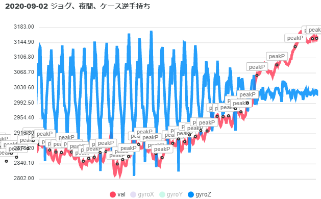

# BLE 対応心拍計(M5Stick-C 利用)

M5Stick-C + 自作センサーモジュールを BLE 対応心拍計として使用するためのソースコード.


概要については、「[M5StickC で BLE対応のスティックタイプな心拍計(概要) | SSD: SHORT SLOW DISTANCE](https://hankei6km.github.io/posts/2020-06-m5stic-c-heart-rate-monitor-ble-intro/)」を参照してください。

## インストール

`$ pio run -e m5stick-c -t upload`

## ボンディング(ペアリング)

M5Stick-C からの出力を `$ pio device monitor -b 115200` 等でをモニターしながら BLE で接続すると、以下のようにランダムな PIN が表示されます.
接続側から PIN を入力することでボンディング(ペアリング)が完了します.

```
PIN(PassKey): 123456
```

## BLE デバイス名を変更

```
$ export BLE_DEVICE_NAME='BLE_DEVICE_NAME=\"my_device01\"'
$ pio run -e m5stick-c -t upload
```

## BLE PIN(PassKey) を静的に指定

```
$ export BLE_STATIC_PASS_KEY='BLE_STATIC_PASS_KEY=123456'
$ pio run -e m5stick-c -t upload
```

6 桁よりも少ない桁数を指定した場合、接続側での入力は 6 桁になるように先頭を `0` で埋める必要があるかもしれません(ie. `12345` で設定した場合、`012345` と入力)。

## スクリーンショット

以下のコマンドでスクリーンショット用のファームウエアへ入れ替え後、モニターを開始。

```
$ pio run -e m5stick-c_screen_shot -t upload
$ pio device monitor -b 115200 | grep -e "==== BMP:" | sed -e "s/==== BMP://" | awk '/[a-zA-Z0-9+\/=]/{ decode ="base64 -i -d | convert bmp:- example" NR ".png "; print $0 | decode ; close(decode) }' RS="---- cut ----"
```

モニターを実行中に以下の手順を実施。

- M5Stick-C の Button B をクリック。
- `Ctrl - C` 等でモニターを停止。
- `example*.png` が作成される。

※ 最後の1枚(1ファイル)は失敗することが多いので、確実にスクリーンショットを取得するならば、Button B を複数回クリックする方が無難です。

## ログ(シリアル経由)

以下のコマンドでログ出力用のファームウエアへ入れ替え後、モニターを開始。

```
$ pio run -e m5stick-c_logging -t upload
$ pio device monitor -b 115200 | sed -e 's/,$/}/'
```

- ログはほぼ Jsonl 形式で出力されます(Jsonl 以外の行も出力されます)。

## ログ(BLE経由)

以下のコマンドでログ出力用のファームウエアへ入れ替え後、`misc/scripts/hrm_dev_log_dump.py` で接続。

```
$ pio run -e m5stick-c_logging -t upload
$ python3 hrm_dev_log_dump.py -a "xx:xx:xx:xx:xx:xx"
```

- スクリプトを実行するデバイスとは事前にペアリングが必要です。[How to connect to peripheral device with pairing key? · Issue #227 · IanHarvey/bluepy · GitHub](https://github.com/IanHarvey/bluepy/issues/227) 等を参考に実施してください。
- ログは Jsonl 形式で出力されます。
- Python スクリプトは Python 3.7 で動作確認しています。
- 別途 [bluepy](https://github.com/IanHarvey/bluepy) が必要です。

ログは、`misc/scripts/jsonl2series.js` で [ApexCharts.js](https://apexcharts.com/) で扱いやすいように series 化できます。

```
$ cat log.jsonl | node jsonl2series.js
```

ApexChart.js での表示サンプル

